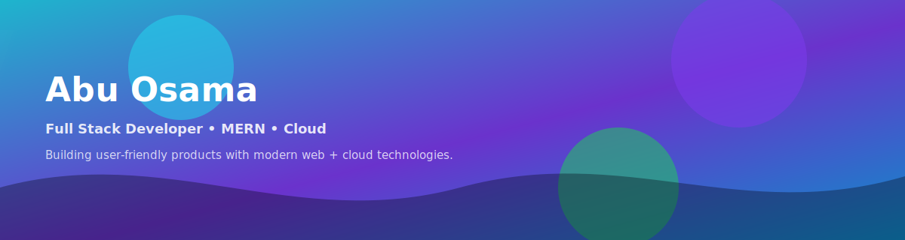

  

  

  
  
  
  
  

  I build clean, scalable web products end-to-end — from UX-driven frontends to reliable APIs and cloud-ready deployments.

  <a href="#now">Now</a> ·
  <a href="#languages-and-tools">Tech</a> ·
  <a href="#github-stats">Stats</a> ·
  <a href="#connect">Connect</a>

  

<table>
<tr>
<td width="56%" valign="top">

## Now

- 🔭 Building and refining full-stack apps with a focus on performance, DX, and maintainable architecture
- 🌱 Deepening expertise in Next.js, AWS, and Terraform (production-grade deployments + IaC)
- 🤝 Open to collaborating on open-source and product-focused web apps
- 💬 Ask me about JavaScript/TypeScript, React, Node.js, Next.js, APIs, and cloud fundamentals
- ⚡ Fun fact: The first “computer bug” was literally a moth (Harvard Mark II, 1947)

### Connect

  
  
  

</td>
<td width="44%" valign="top">

## Snapshot

- **Primary focus:** Full-stack product development (MERN + Next.js)
- **I care about:** Performance, clean architecture, and developer experience
- **Comfortable with:** APIs, auth, databases, deployments, and automation
- **Currently leveling up:** AWS + Terraform (IaC)

  
  
  

</td>
</tr>
</table>

  

## Languages and Tools

  
  
  
  
  

<table>
<tr>
<td width="33%" valign="top">

  

  
  
  
  
  
  
  
  

</td>
<td width="33%" valign="top">

  

  
  
  
  
  

  

  
  

</td>
<td width="33%" valign="top">

  

  
  
  
  

  

  
  

  

  
  

</td>
</tr>
</table>

  

## GitHub Stats

  
 

  

  

  

  

